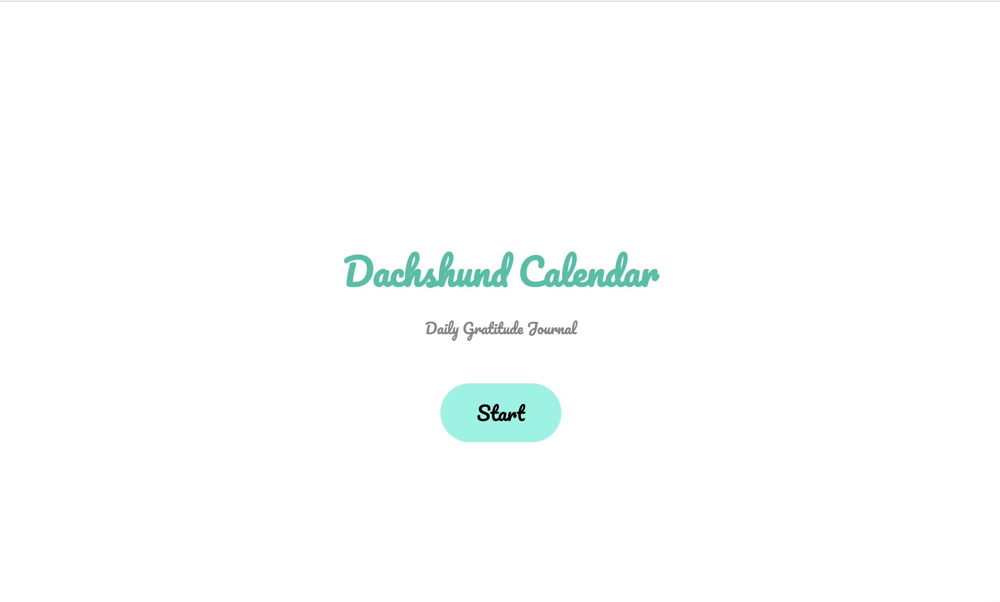
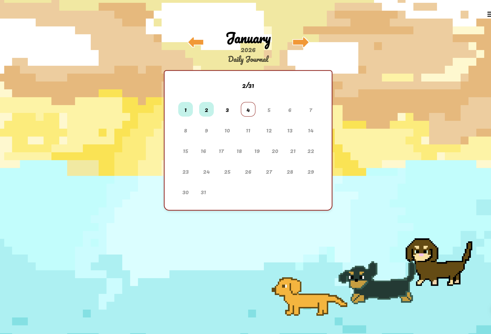
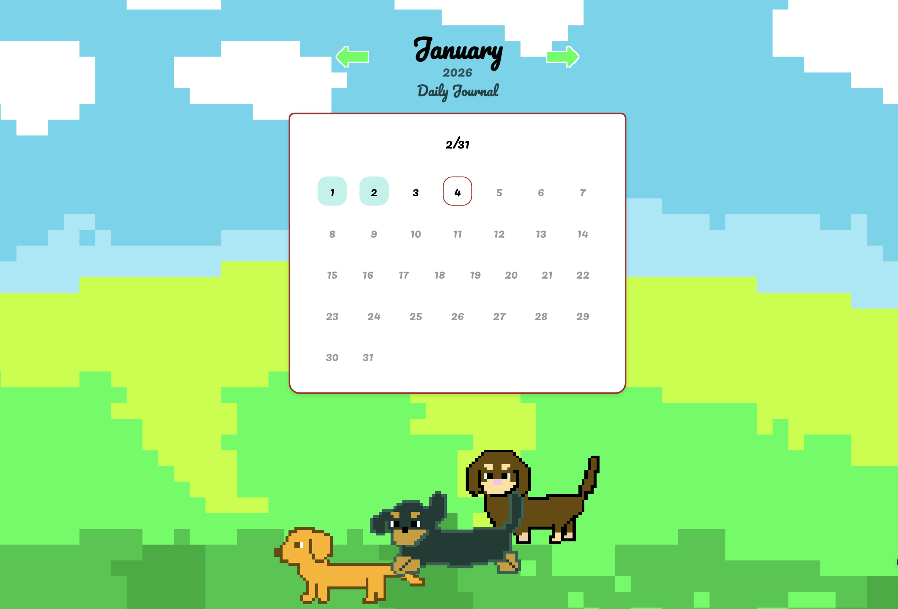
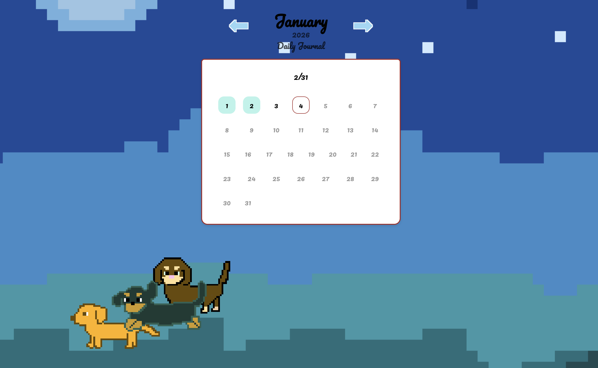
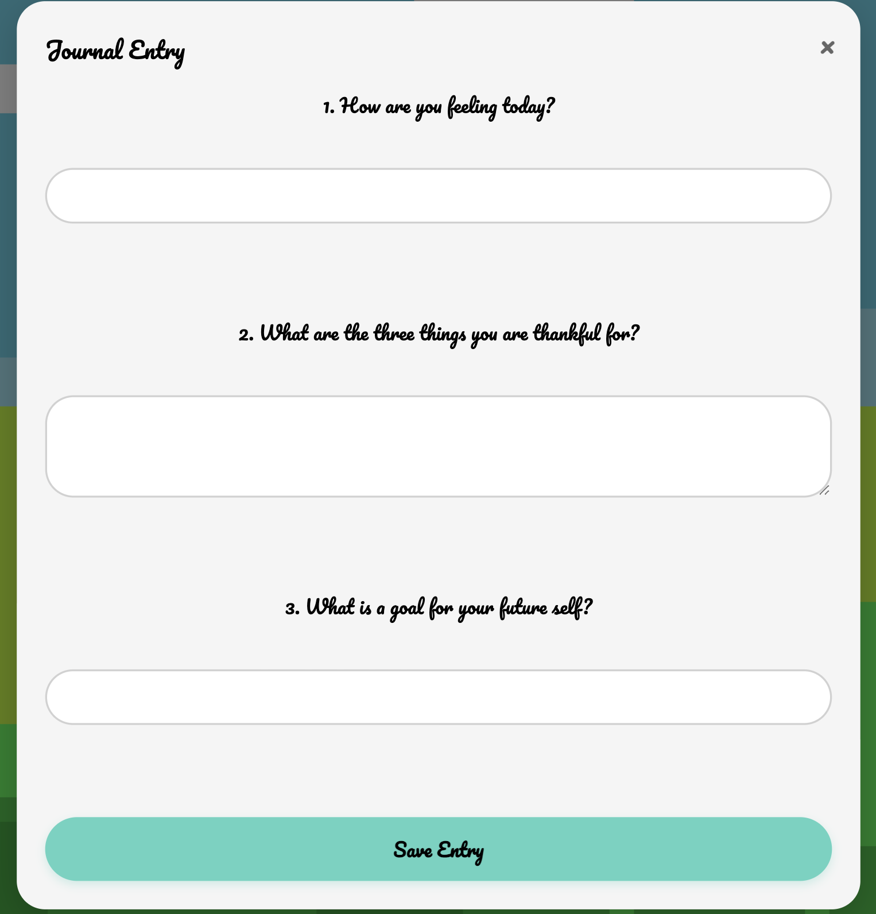
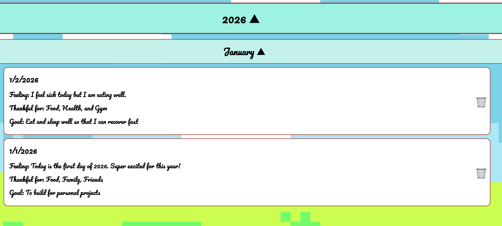
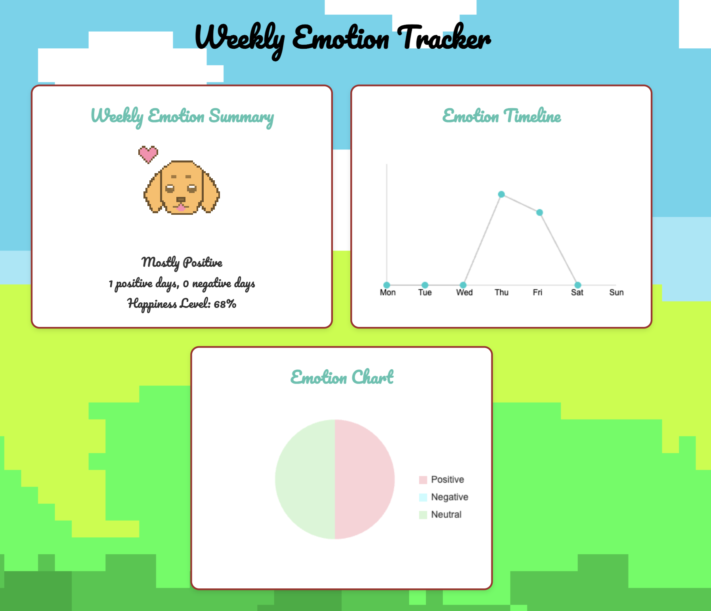

# Dachshund Gratitude Journal Calendar

A dachshund themed gratitude journal with AI-powered sentiment analysis, animated dachshunds, and dynamic time-based backgrounds.



## Features

### Interactive Calendar
- Click any past or present day to write a journal entry
- Visual feedback for completed days
- Current day highlighted with border
- Navigate between months with animated arrows

### Dynamic Time-Based Backgrounds
The app automatically changes its background based on the time of day:
- **Morning (4am-8am)**: Soft sunrise colors
- **Day (8am-5pm)**: Bright daytime sky
- **Night (5pm-4am)**: Peaceful nighttime scene

| Morning | Day | Night |
|---------|-----|-------|
|  |  |  |

### Animated Dachshunds
- Three pixel-art dachshunds walk across the bottom of the screen
- Each has unique walking path and speed
- **Click them to hear them bark!** 
- Frame-by-frame walking animation


### Journal Entry
Write your daily reflections with three guided prompts:
1. How are you feeling today?
2. What are you thankful for?
3. What is a goal for your future self?



### Journal List
- Organized by year and month
- Expandable/collapsible sections
- Edit or delete existing entries
- Beautiful card-based layout



### AI-Powered Sentiment Analysis
- Uses HuggingFace's DistilBERT model to analyze your entries
- Automatically detects emotional tone (Positive/Negative/Neutral)
- Falls back to keyword analysis if AI is unavailable

### Weekly Emotional Insights
Track your emotional journey with beautiful visualizations:
- **Emotion Summary**: Overall weekly mood snapshot with pixel art emoji
- **Timeline Chart**: Animated day-by-day sentiment tracking
- **Pie Chart**: Distribution of emotions throughout the week



### Sound Effects
- Button click sounds for interactive feedback
- Bark sound when clicking dachshunds
- Trash sound when deleting entries

## Setup Instructions

### Prerequisites

- [Node.js](https://nodejs.org/) (v14 or higher)
- [VS Code](https://code.visualstudio.com/) with Live Server extension
- A [HuggingFace](https://huggingface.co/) account (free)

### Installation

1. **Clone the repository:**
```bash
   git clone https://github.com/yourusername/gratitude-journal.git
   cd Calendar_Project
```

2. **Install backend dependencies:**
```bash
   cd backend
   npm install
```

3. **Set up environment variables:**
   - Create a `.env` file in the `backend` folder
   - Get a HuggingFace API token from https://huggingface.co/settings/tokens
   - Add to `.env`:
```
     HF_API_TOKEN=your_huggingface_token_here
```

4. **Start the backend server:**
```bash
   node server.js
```
   You should see: `Server running on http://localhost:3000`

5. **Open the frontend:**
   - Open the project in VS Code
   - Right-click on `frontend/journal.html`
   - Select "Open with Live Server"

## Usage

1. Click **"Start"** on the welcome screen
2. Click any day on the calendar to write a journal entry
3. Fill in your feelings, gratitude, and goals
4. Click **"Save Entry"**
5. View your entries in **"Journal List"** (hamburger menu)
6. Check your weekly emotional insights in **"Weekly Tracker"**
7. **Click the dachshunds** to hear them bark!

## 🛠 Built with 


- **Frontend**: HTML, CSS, JavaScript
- **Backend**: Node.js, Express
- **AI**: HuggingFace Inference API (DistilBERT)
- **Storage**: localStorage (client-side)

## Project Structure
```
Calendar_Project/
├── frontend/
│   ├── journal.html          # Main HTML file
│   ├── journal.css           # Styles
│   ├── journal.js            # Frontend JavaScript
│   ├── *.png                 # Images (backgrounds, dachshunds, emotions)
│   └── *.mp3                 # Sound effects
├── backend/
│   ├── server.js             # Express server
│   ├── package.json          # Dependencies
│   └── .env                  # Environment variables (not in git)
├── screenshots/              # App screenshots
├── .gitignore
└── README.md
```

## Troubleshooting

**CORS errors:**
- Make sure both backend server AND Live Server are running
- Backend should be on port 3000
- Frontend will auto-detect the correct host

**Sentiment analysis not working:**
- Check that your `.env` file has a valid HuggingFace token
- Verify the backend server is running
- Check browser console for errors
- The app will fall back to keyword analysis if BERT is unavailable

**Live Server not working:**
- Install the "Live Server" extension in VS Code
- Or use Python: `python3 -m http.server 8000` in the frontend folder

## Inspiration & Acknowledgment

This project was initially inspired by a habit tracker tutorial by **[Cozy Olive Studios](https://youtu.be/-OcVVgDLI3U?si=3G7QeJLt8zJiZipy | https://youtu.be/-OcVVgDLI3U?si=6CjSyhF64wiZtEDN)**, which I used as a learning reference for basic structure and workflow.

Since then, the project has been significantly expanded and redesigned. Additional features, system architecture, UI/UX decisions, backend logic, data handling, and AI-powered functionality were independently designed and implemented by me. The final application goes well beyond the original reference and reflects my own ideas, problem-solving approach, and technical decisions.

## Contributing

Feel free to fork and submit pull requests!

## License

MIT License - feel free to use this project however you'd like!
